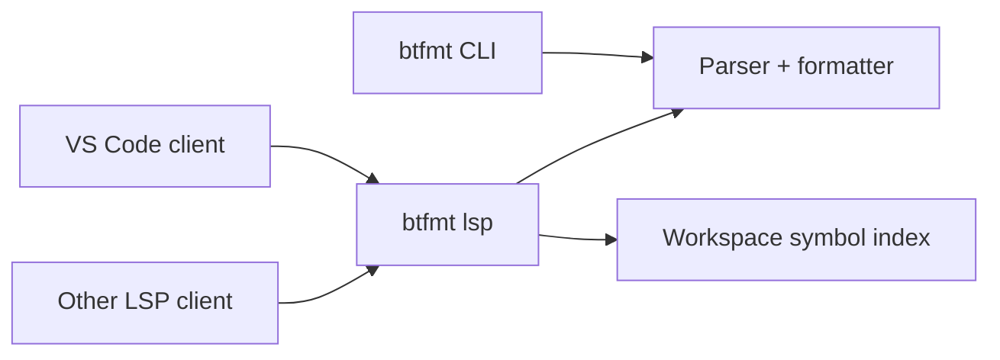

<p align="center">
  
</p>

<h1 align="center">btfmt</h1>

<p align="center">
  Formatter and language tooling for bpftrace.
</p>

<p align="center">
  <a href="https://github.com/fanyang89/bpftrace-formatter/actions/workflows/ci.yml"></a>
  <a href="https://github.com/fanyang89/bpftrace-formatter/releases/latest"></a>
  <a href="LICENSE"></a>
</p>

<p align="center">
  <a href="#install">Install</a> ·
  <a href="#quick-start">Quick start</a> ·
  <a href="#language-features">Language features</a> ·
  <a href="docs/configuration.md">Configuration</a> ·
  <a href="README_zh-CN.md">中文</a>
</p>

btfmt gives bpftrace scripts deterministic formatting and editor intelligence from one native binary. Use it as a CLI in local workflows and CI, run it as a standard LSP server, or install the platform-specific VS Code extension.

<p align="center">
  
</p>

## What You Get

| Formatter | Language Server | VS Code |
| --- | --- | --- |
| Stable indentation, spacing, braces, and line breaks | Diagnostics, hover, completion, navigation, and rename | Bundled native server, syntax highlighting, format-on-save, and language status |
| Comments, shebangs, and preprocessor regions preserved | Workspace-aware maps, macros, imports, and symbols | Local, Remote SSH, WSL, and Dev Container support |
| Multiple files, stdin, in-place writes, and CI checks | Rootless probe and `args` completion with graceful fallback | Restricted Mode with reduced workspace access |

## Install

Download the latest CLI archive or platform-specific VSIX from [GitHub Releases](https://github.com/fanyang89/bpftrace-formatter/releases/latest).

| Platform | CLI archive | VS Code package |
| --- | --- | --- |
| Linux x64 | `btfmt-linux-amd64.tar.gz` | `btfmt-linux-x64-<version>.vsix` |
| macOS x64 | `btfmt-darwin-amd64.tar.gz` | `btfmt-darwin-x64-<version>.vsix` |
| macOS ARM64 | `btfmt-darwin-arm64.tar.gz` | `btfmt-darwin-arm64-<version>.vsix` |
| Windows x64 | `btfmt-windows-amd64.zip` | `btfmt-win32-x64-<version>.vsix` |

Install the Linux CLI:

```bash
tar -xzf btfmt-linux-amd64.tar.gz
mkdir -p ~/.local/bin
install -m 755 btfmt ~/.local/bin/btfmt
```

Install the VS Code package with **Extensions: Install from VSIX...**.

Build the CLI from source:

```bash
cargo install --locked --git https://github.com/fanyang89/bpftrace-formatter.git
```

## Quick Start

```bash
btfmt script.bt                 # formatted output on stdout
btfmt --write script.bt         # write back atomically
btfmt --check scripts/*.bt      # non-zero when formatting differs
cat script.bt | btfmt -         # explicit stdin
```

Enable format-on-save in VS Code:

```json
"[bpftrace]": {
  "editor.defaultFormatter": "fanyang89.btfmt",
  "editor.formatOnSave": true
}
```

<details>
<summary>Formatting example</summary>

Before:

```bpftrace
tracepoint:syscalls:sys_enter_openat{printf("openat: %s\n",str(args.filename));}
```

After:

```bpftrace
tracepoint:syscalls:sys_enter_openat
{
    printf("openat: %s\n", str(args.filename));
}
```

</details>

## Language Features

| Capability | Scope |
| --- | --- |
| Completion | Builtins, providers, keywords, variables, maps, macro parameters, imported macros, probe targets, and `args` fields |
| Navigation | Definitions, references, highlights, and document symbols |
| Rename | Lexical variables plus workspace-wide maps and macro families |
| Hover | Versioned bpftrace builtin documentation |
| Diagnostics | Syntax errors with UTF-16-correct editor ranges |
| Formatting | Shared CLI/LSP engine and per-workspace `.btfmt.json` |

Probe completion never invokes `sudo` or runs bpftrace. It combines symbols observed in the workspace, portable event catalogs, and kernel metadata readable by the current user. Missing kernel access is a normal limited-data environment, not an error.

## Configuration

Generate a complete configuration file:

```bash
btfmt --generate-config
```

```json
{
  "indent": { "size": 4, "use_spaces": true },
  "blocks": { "brace_style": "next_line", "indent_statements": true }
}
```

See [Configuration](docs/configuration.md) for every option, validation rule, and the distinct CLI/LSP search order.

## LSP And Architecture

Start the stdio language server for any compatible editor:

```bash
btfmt lsp
```



The parser comes from the pinned `tree-sitter-bpftrace` crate; generated parser sources are not vendored here.

## Development

```bash
task build
task test
task ci
```

See [AGENTS.md](AGENTS.md) for repository conventions and [`vscode-extension/PUBLISHING.md`](vscode-extension/PUBLISHING.md) for release operations.

## Support And License

- [Releases](https://github.com/fanyang89/bpftrace-formatter/releases)
- [Issue tracker](https://github.com/fanyang89/bpftrace-formatter/issues)
- [VS Code troubleshooting](vscode-extension/SUPPORT.md)
- [Unlicense](LICENSE)
