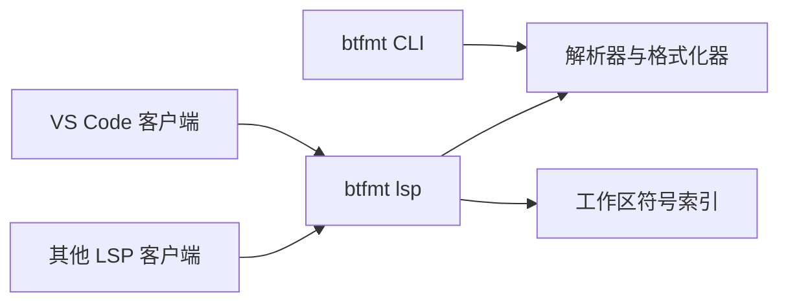

<p align="center">
  
</p>

<h1 align="center">btfmt</h1>

<p align="center">
  面向 bpftrace 的格式化与语言工具。
</p>

<p align="center">
  <a href="https://github.com/fanyang89/bpftrace-formatter/actions/workflows/ci.yml"></a>
  <a href="https://github.com/fanyang89/bpftrace-formatter/releases/latest"></a>
  <a href="LICENSE"></a>
</p>

<p align="center">
  <a href="#安装">安装</a> ·
  <a href="#快速开始">快速开始</a> ·
  <a href="#语言功能">语言功能</a> ·
  <a href="docs/configuration.md">配置</a> ·
  <a href="README.md">English</a>
</p>

btfmt 通过一个原生二进制为 bpftrace 脚本提供确定性的格式化和编辑器语言能力。它既可以作为本地及 CI 中的命令行工具，也可以作为标准 LSP 服务运行，或通过平台专用的 VS Code 扩展直接使用。

<p align="center">
  
</p>

## 功能一览

| 格式化器 | 语言服务器 | VS Code |
| --- | --- | --- |
| 统一缩进、空格、花括号和空行 | 诊断、悬停文档、补全、导航和重命名 | 内置原生服务、语法高亮、保存时格式化和语言状态 |
| 保留注释、shebang 和预处理区域 | 感知工作区中的 Map、Macro、import 和符号 | 支持本地、Remote SSH、WSL 和 Dev Container |
| 支持多文件、标准输入、就地写入和 CI 检查 | 无需 root 的 probe 与 `args` 补全，并可平滑降级 | 受限模式下减少工作区访问 |

## 安装

从 [GitHub Releases](https://github.com/fanyang89/bpftrace-formatter/releases/latest) 下载最新的命令行压缩包或平台专用 VSIX。

| 平台 | CLI 压缩包 | VS Code 扩展 |
| --- | --- | --- |
| Linux x64 | `btfmt-linux-amd64.tar.gz` | `btfmt-linux-x64-<version>.vsix` |
| macOS x64 | `btfmt-darwin-amd64.tar.gz` | `btfmt-darwin-x64-<version>.vsix` |
| macOS ARM64 | `btfmt-darwin-arm64.tar.gz` | `btfmt-darwin-arm64-<version>.vsix` |
| Windows x64 | `btfmt-windows-amd64.zip` | `btfmt-win32-x64-<version>.vsix` |

安装 Linux CLI：

```bash
tar -xzf btfmt-linux-amd64.tar.gz
mkdir -p ~/.local/bin
install -m 755 btfmt ~/.local/bin/btfmt
```

通过 **Extensions: Install from VSIX...** 安装 VS Code 扩展。

从源码构建 CLI：

```bash
cargo install --locked --git https://github.com/fanyang89/bpftrace-formatter.git
```

## 快速开始

```bash
btfmt script.bt                 # 输出格式化结果
btfmt --write script.bt         # 原子写回源文件
btfmt --check scripts/*.bt      # 格式不一致时返回非零状态
cat script.bt | btfmt -         # 显式读取标准输入
```

在 VS Code 中启用保存时格式化：

```json
"[bpftrace]": {
  "editor.defaultFormatter": "fanyang89.btfmt",
  "editor.formatOnSave": true
}
```

<details>
<summary>格式化示例</summary>

格式化前：

```bpftrace
tracepoint:syscalls:sys_enter_openat{printf("openat: %s\n",str(args.filename));}
```

格式化后：

```bpftrace
tracepoint:syscalls:sys_enter_openat
{
    printf("openat: %s\n", str(args.filename));
}
```

</details>

## 语言功能

| 能力 | 范围 |
| --- | --- |
| 补全 | 内置函数、provider、关键字、变量、Map、Macro 参数、导入的 Macro、probe target 和 `args` 字段 |
| 导航 | 定义、引用、高亮和文档符号 |
| 重命名 | 词法变量，以及工作区范围内的 Map 与同名 Macro |
| 悬停文档 | 与版本对应的 bpftrace 内置函数说明 |
| 诊断 | 使用 UTF-16 正确编辑器范围的语法错误 |
| 格式化 | CLI 与 LSP 共享引擎，并支持工作区级 `.btfmt.json` |

probe 补全不会调用 `sudo`，也不会运行 bpftrace。候选项来自工作区中已出现的符号、可移植事件目录，以及当前用户可读的内核元数据。无法读取内核数据属于正常的受限环境，不会被视为错误。

## 配置

生成完整配置文件：

```bash
btfmt --generate-config
```

```json
{
  "indent": { "size": 4, "use_spaces": true },
  "blocks": { "brace_style": "next_line", "indent_statements": true }
}
```

完整选项、校验规则，以及 CLI 与 LSP 各自的搜索顺序见 [配置参考](docs/configuration.md)。

## LSP 与架构

为其他兼容编辑器启动 stdio 语言服务器：

```bash
btfmt lsp
```



解析器来自固定版本的 `tree-sitter-bpftrace` crate；仓库不包含生成的 parser 源码。

## 开发

```bash
task build
task test
task ci
```

仓库约定见 [AGENTS.md](AGENTS.md)，发布流程见 [`vscode-extension/PUBLISHING.md`](vscode-extension/PUBLISHING.md)。

## 支持与许可证

- [版本发布](https://github.com/fanyang89/bpftrace-formatter/releases)
- [问题跟踪](https://github.com/fanyang89/bpftrace-formatter/issues)
- [VS Code 故障排查](vscode-extension/SUPPORT.md)
- [Unlicense](LICENSE)
