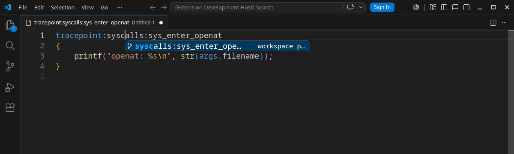

<p align="center">
  
</p>

<h1 align="center">btfmt - bpftrace Language Support</h1>

<p align="center">Format, complete, and navigate bpftrace scripts with a bundled native language server.</p>

<p align="center">
  
</p>

## Language Features

| Feature | Support |
| --- | --- |
| Formatting | Document and format-on-save |
| Completion | Builtins, providers, probe targets, `args` fields, variables, maps, and macros |
| Navigation | Definitions, references, highlights, and document symbols |
| Refactoring | Scope-aware and cross-file rename |
| Diagnostics | Syntax errors with UTF-16-correct ranges |
| Syntax | TextMate highlighting for `.bt` files |

## Quick Start

Open a `.bt` file and run **Format Document**. To enable format on save:

```json
"[bpftrace]": {
  "editor.defaultFormatter": "fanyang89.btfmt",
  "editor.formatOnSave": true
}
```

The extension uses its bundled `btfmt` server by default. No separate formatter installation is required.

Platform-specific VSIX files are available from [GitHub Releases](https://github.com/fanyang89/bpftrace-formatter/releases/latest).

## Completion Without Root

Probe target and `args` field completion never invokes `sudo` or runs bpftrace. Candidates come from:

- Probe and field usage in the current workspace
- Kernel tracepoint metadata when it is readable by the current user
- An embedded portable catalog for tracepoint, hardware, software, profile, and interval probes

Catalog entries are cross-kernel suggestions. Readable kernel metadata takes precedence when available; unavailable metadata is treated as a normal limited-data environment, not an error.

## Commands

- **btfmt: Restart Server**
- **btfmt: Show Logs**
- **btfmt: Open Settings**

## Settings

| Setting | Default | Description |
| --- | --- | --- |
| `btfmt.serverPath` | `""` | Custom server. Empty uses the bundled binary, then PATH as fallback. |
| `btfmt.configPath` | `""` | Absolute or workspace-relative `.btfmt.json` path. |

## Remote And Restricted Workspaces

The extension runs where the workspace lives, including Remote SSH, WSL, and Dev Containers. Install the matching platform package in the remote Extension Host.

Restricted Mode keeps current-document formatting, diagnostics, and static completion. Workspace indexing and system metadata access remain disabled until the workspace is trusted.

## Privacy

btfmt does not collect telemetry. Source code and workspace paths remain local to the Extension Host.

## Support

See [SUPPORT.md](SUPPORT.md) for troubleshooting and issue reporting. Release history is available in [CHANGELOG.md](CHANGELOG.md), and full CLI/LSP documentation lives in the [project repository](https://github.com/fanyang89/bpftrace-formatter).
